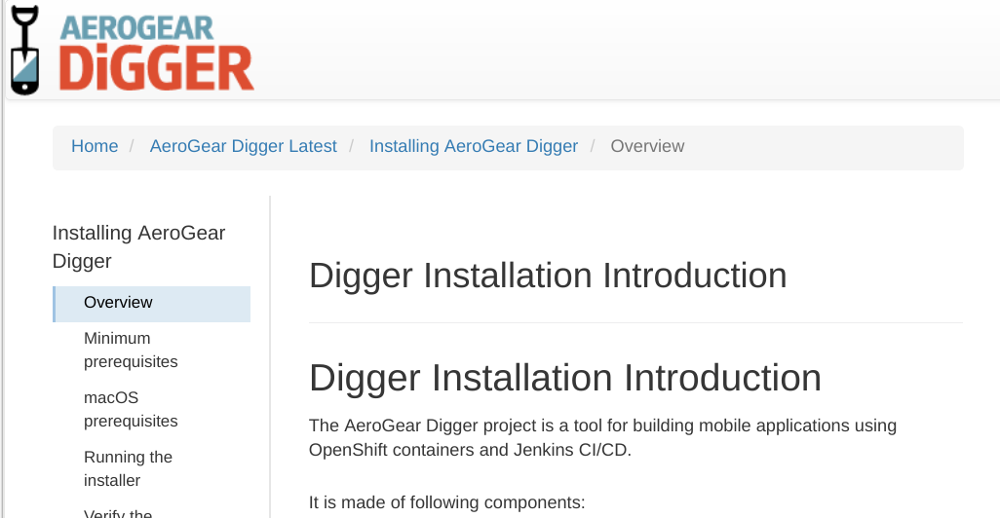
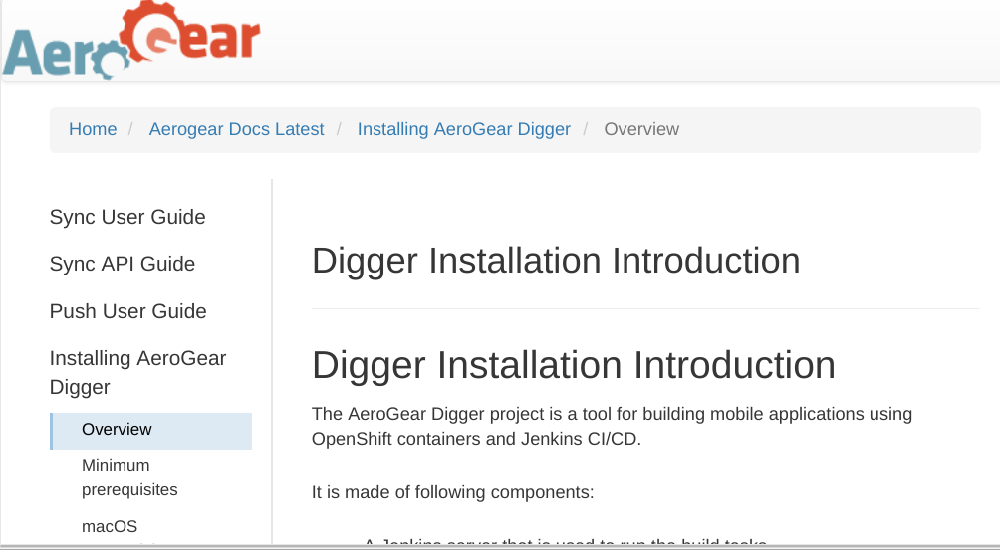

= Aerogear.org Documentation

== Introduction
TLDR; See a demo link:https://2-106556484-gh.circle-artifacts.com/0/home/circleci/docs/_preview/aerogear/latest/admin/about-admin-guide.html#[doc set].

Everyone should be able to contribute to aerogear.org docs with ease and effectiveness, regardless of the scope of their proposed change.
At the moment, changes are difficult to author and manage, and we hope to extend the site to include mobile.next and feedhenry material.
This proposal includes using asciibinder and a modular approach to documentation to help us deliver high quality documentation to enable the community use AeroGear software.

== Problem Description

* Multiple navigation paths - there are many ways to navigate to a document, and not all give a positive experience, eg https://aerogear.org/docs/
* Authoring requires rvm for preview, reducing contributions
* Confusing terminology - modules, 'getting started', platforms
* Asciidoc is used, but not a standard way
* Stale content
* Not much versioning - "As a developer I want to view the docs for a component I downloaded last year"
* Documentation for a feature (or service) can be fragmented and difficult to contribute to.

== Proposed Solution

=== Asciibinder

link:http://asciibinder.org/[Asciibinder] is used by some OSS projects for example:

* https://docs.openshift.org/latest/welcome/index.html
* https://docs.fedoraproject.org/
* http://manageiq.org/docs/

It uses asciidoc formatting, which is required for RH official documentation. Note, there is a PR to include markdown support.

"AsciiBinder is for documenting versioned, interrelated projects, producing different distributions of the docs as required."

=== Modular documentation

Aerogear will consist of many components (services) that have version specific documentation. Aerogear.org is where all that documentation will be published, however we want to make the process of contributing and publishing as easy as possible by:

. Documentation for a versioned service is authored in it's own repo. 
. Documentation for all services is gathered as late as possible for publication on aerogear.org.

A repo for docs corresponding to each service is required because:

* it corresponds with end user's expectation: "As a developer I want to include sync in my app, well there's a docs repo for that".
* it makes it easier to contribute (where would I update if I wanted to write some conceptual doc about sync?)
* it makes it easier to track (docs have limited resources and would not need to filter code change history)
* it makes it easier to version (see versioning proposal from Wei and Chris, which should include proposal about automatic tagging of docs repo when code repo is tagged).

[NOTE]
====
This compliments the link:https://redhat-documentation.github.io/modular-docs/[RH Modular Docs initiative], which can be summarized as follows wrt Mobile.next:

* Concepts - Diagrams and text introducing the terminology and features of MC and Services.
* Procedures - How to get started with using mobile services in your application development - for example, how to integrate sync into your iOS app.
* Reference - API documentation for SDKs and Backends integrated into <service>-docs repo as per raincatcher.
* Assemblies - Pulling together all the documentation for a Mobile service. 

====

=== Demo

This demo uses github and circleci, fork and build as required. 

Consider the following 'feature' doc repos:

* https://github.com/finp/sync-docs
* https://github.com/finp/push-docs
* https://github.com/finp/digger-docs

Each release branch is rendered using asciibinder, for example, see link:https://5-114535426-gh.circle-artifacts.com/0/home/circleci/docs/_preview/digger/latest/installation/digger-install-intro.html[Digger docs]. 

To pull the features together, I've included a `package.json` file in each repo, and then made the master branch of those repos a dependency to render a more complete link:https://2-106556484-gh.circle-artifacts.com/0/home/circleci/docs/_preview/aerogear/latest/admin/about-admin-guide.html#[doc set], including sync and push docs.

[NOTE] 
====
This requires some symlinks and concating topic files, see https://github.com/finp/shiftgear.

Note the mechanism for automatic assembly is just `npm install`:
----
"dependencies": {
   "digger-docs": "git@github.com:finp/digger-docs.git#master",
   "push-docs": "git@github.com:finp/push-docs.git#master",
   "sync-docs": "git@github.com:finp/sync-docs.git#master"
   }
----
====

=== Search

A trivial approach to making AeroGear docs discoverable would be to link:https://support.google.com/customsearch/answer/2630963[create a custom search engine] targeting a url pattern such as aerogear.org/docs

This could then be extended to provide powerful search if we decide to publish particular doc sets. For example, npm could be used to publish all the branches for a component to a directory using `_distro.yml`, combined with a `package.json` such as:

----
"dependencies": {
   "sync-docs-latest": "git@github.com:finp/sync-docs.git#master"
   },
   "sync-docs-1.0.0": "git@github.com:finp/sync-docs.git#1.0.0"
   },
   "sync-docs-1.2.0": "git@github.com:finp/sync-docs.git#1.1.0"
   }
----

This would publish a doc set combined with a custom engine that would allow users to search all versions of sync docs. 

== Conclusion

The advantages I see for this approach is:

* Mix and match component documentation
* Mix and match versions of component documenation
* Contributors write docs in the context of the feature, not on a monolithic website repo
* Tech writers can work with the development process 

NOTE: Typically, tech writers rail against feature documentation, wanting instead to document user stories. When the word 'feature' is mentioned above, it is in the context of a major user story, eg sync and push. 

Alternatives approaches include

* link:http://idratherbewriting.com/documentation-theme-jekyll/[Keep using Jekyll] but with a more docs-centric approach
* link:https://appdev.openshift.io/docs/nodejs-runtime.html[Simple asciidoc] user story approach

