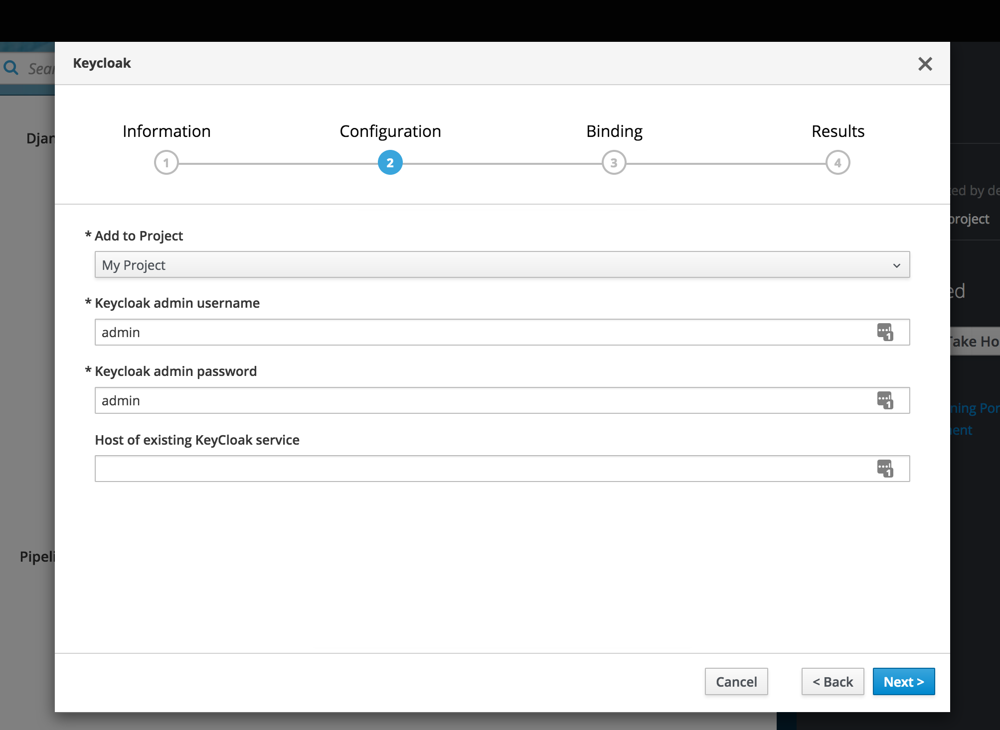

# Abstract

When a service is suitable for sharing across namespaces and already deployed and available in some manner, the APB for deploying those services should be programmed to re-use the service that is available rather than deploying another instance of it. The service is not required to be running in OpenShift.

## Terms

- APB ([ansible playbook bundle](https://docs.openshift.org/latest/apb_devel/index.html))
- Shared Service: A running instance of a service that may be used across multiple namespaces
- Connected Service: The result of running an APB in a seperate namespace to configure a shared service
- System Resources: CPU or memory
- Namespace / Project: These refer to the same thing and may be used interchangably.
- apb.yml: ([APB spec file](https://docs.openshift.org/latest/apb_devel/writing/reference.html#apb-devel-writing-ref-spec)) Configures the inputs passed to an APB prior to deployment.

## Problem Description

Some of the services used in the development of a mobile application can require quite a lot of system resources which could turn into a factor that limits adoption of the Mobile Services.

For example, if multiple developers are building a product which requires an Authentication Service, and they do not have the resources available to run a seperate instance of an Authentication Service in each developers project, there is currently no convenient way for all of these developers to develop their application using a single shared Authentication Service.

## Goals

- A convenient way for the developer to tell the platform about an existing deployment of the service he is about to deploy.
- The APB for a connected service automatically connecting to a shared service in another namespace, using the provided details.
- The APB for a connected service automatically configuring a shared service in another namespace and exposing the configuration details to the current namespace.
- The APB for a connected service configuring the shared service during a bind operation.
- The APB for a connected service deconfiguring the shared service during an unbind operation.

## Non-Goals

- The platform intelligently discovering and connecting to services that are running in seperate namespaces.
- The platform intelligently discovering and suggesting services to connect to.

## Proposed Solution

### Provision
For services that are suited to being shared services (such as KeyCloak), we can make a change the apb.yml, allowing the developer to specify connection details for an already existing instance of the service this APB would otherwise deploy.

Example:

In this example, if the `Host of existing KeyCloak service` were left empty then a new service would be installed. However if this field were populated the APB would connect to the host with the provided auth details and then complete the APB as usual using this existing shared Service.

Once the shared service has been configured via the APB, the APB will then expose these configuration details to the current namespace in it's usual manner (i.e. config-map, secret, etc).

If the APB is unable to connect to the supplied Shared Service details then the APB should exit with a failure status and report the problem in a way that will make trouble-shooting as convenient as possible for the developer.

Most, if not all, of this work will be executed inside the APB logic for services deemed suitable for conversion to a Shared Service. Possible candidates for this work are listed below, but this list is not final:
- KeyCloak
- UPS
- Build Farm

### Deprovision
When running a deprovision of Connected Service, the APB should clear up it's own configuration from the shared service, but should not deprovision the shared service.

For example, in namespace-a the KeyCloak APB would have connected to KeyCloak in namespace-b and created a realm, a client, and a bearer-client. This realm and users should be removed from KeyCloak in namespace-b and the secret they are stored in, in namespace-a. Keycloak in namespace-b will still be running when this is completed.

When the deprovision is being executed in the namespace that the Shared Service is deployed into, then all of the resources for that shared service should be removed.

For example, in namespace-a the KeyCloak service is running and in namespace-b there is a connected service for keycloak. When running the deprovision for the KeyCloak in namespace-a the service and all of it's resource will be deleted from namespace-a even though there is still a connected service in namespace-b for this keycloak.

### Bind / Unbind

When running a bind, the APB should connect to the shared service and do any necessary configuration, however the parameters provided during provision are [not made available to the bind/unbind playbooks currently](https://github.com/openshift/ansible-service-broker/issues/530), so to have access to these the simplest solution at the moment is to store them in a secret where you can access them during the bind/unbind playbook.

The unbind playbook should remove any configuration that was create in the Shared Service during binding.

### Upgrade

Upgrades of services using APBs is unlikely to be affected by this feature.

### Potential Difficulties

#### Cluttered Configuration Screen
The form for configuring the shared service via the APB could start looking quite busy with the extra inputs, an ideal solution to this would be fields that display conditionally with a check-box like "This is a shared service" which would hide the deploy options and instead display the shared service options, at the moment this is not possible, but having contacted the ASB team they have informed that it is on their roadmap.
