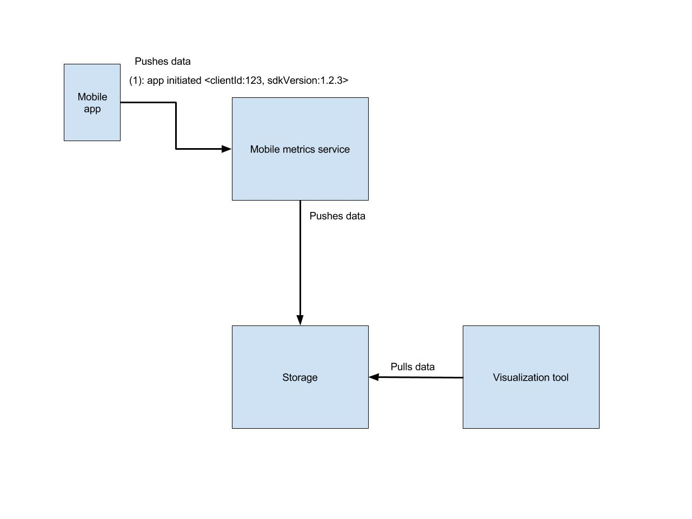

# Abstract

This document contains the proposal for gathering metrics on system statistics for running Mobile Apps and making them available to developers.

## Goals

### Primary Goals

- Provide mobile app developers a service that can receive overall runtime metrics (processor and memory data, authentication events, runtime versions, networking events, etc).

- Provide developers an interface to query and visualize the gathered data in order to make informed decisions towards deployment, deprecation of backend services and other actions that depend on the state of an application's installed base.

### Secondary Goals

- Provide mobile app developers with an easy to use SDK to connect easily and securely to the metrics service

### Non Goals

- Identify individual devices or users in metrics events

- Registering of user-defined metrics and logs

## Terms

For a list of terms used in this document, see [Glossary](./glossary.md).

## Problem Description

As Mobile Apps are developed, improved and iterated on, different versions of those Apps can be used on many different devices. System metrics data becomes invaluable for developers to observe the landscape of application installations and make sure further development and deployment of backend services will not affect users.

## Proposed Solution

A Metrics Service will be available from the Service Catalog, which can be provisioned by developers for use with their mobile applications.

The extra components outlined in this proposal will be added to the existing components outlined in the [Metrics Endpoints and Auto Discovery Proposal](./mobile-app-metrics-service.md).

The following diagram illustrates the components of the Metrics Service:

### Mobile App Client

A native, platform-specific SDK for targetting the Metrics Service will be available to developers.

Upon installation into a project and providing configuration for targetting the Metrics Service the SDK will automatically send general information about the general runtime for this application with a unique device ID, namely the `[SDK Version, clientID, timestamp]` tuple upon application initialization.

The SDK will also instrument calls at the network level in order to gather metrics around communication and bandwith consumption.

Other system resources utilization data can also be sent periodically.

### Mobile Metrics Service

A thin HTTP-based service will be present to receive metrics data from the mobile applications in an storage-agnostic way, then forwarding to the Storage service.

Compared to mobile applications interfacing directly with the Storage service, this presents the following tradeoff:

#### Pros

- Possibility to upgrade or change the Storage service independently of mobile client SDK version and implementation;

- Possible support for different Storage engines which can be selected based on application needs;

#### Cons

- Extra service deployment and scaling needs;

- Development and maintenance of the new service;

- Types of gathered metrics can become a subset of the underlying Storage's full range of types.

#### HTTP Endpoints

At a PoC level, the endpoints available from the Mobile Metrics Service should be:

`POST /sdk-version`

Receives `Content-Type: application/json` containing the SDK Version and a clientID that should be called from the SDK initialization process. A timestamp can be generated server-side.

### Authentication for the Mobile Metrics Service

The HTTP endpoints for the Mobile Metrics Service is going to be accessbile only via HTTPS to devices that provide an authentication header containing an appropriate API Key.

This key will be acessible to the SDK via new fields in the generated `mobile-services.json` from the mobile CLI.

### Storage

The Storage service will store metrics data forwarded from the Mobile Metrics Service.

The requirements and preferences for the selected implementation are as follows:

- Serve as a long-term storage for the back-end metrics Prometheus instance
- Be able to become a Data Source for Grafana in order to avoid a separate visualisation layer
- Low enough resource usage in order to run in low-powered "evaluation" OpenShift clusters.
- Flexibility in metrics types for future-proofing

After spiking various solutions the final decision was to go with {SOLUTION}, see [Spike: Mobile app level and SDK level metrics](https://issues.jboss.org/browse/AEROGEAR-1894).

### Querying and Data Visualisation

The Querying and Visualization service will be supplied by Grafana, which can utilize the Storage service implementation directly as a Data Source.

User interface familiarity is an important factor for developers that use the overall metrics service, so addition of other visualisation tools like Kibana that would increase the learning curve of the solution should be avoided.

In order to support additional chart types (i.e. pie charts for SDK version distribution) the Grafana instance will be incremented with visualisation plugins added during provisioning as opposed to creating a new derived container image.

#### Authentication For the Data Visualisation UI

As shared with the backend metrics service, Grafana's service will be behind OpenShift's [OAuth Proxy](https://github.com/openshift/oauth-proxy) that will pick up the permissions of the user's OpenShift cluster credentials.
